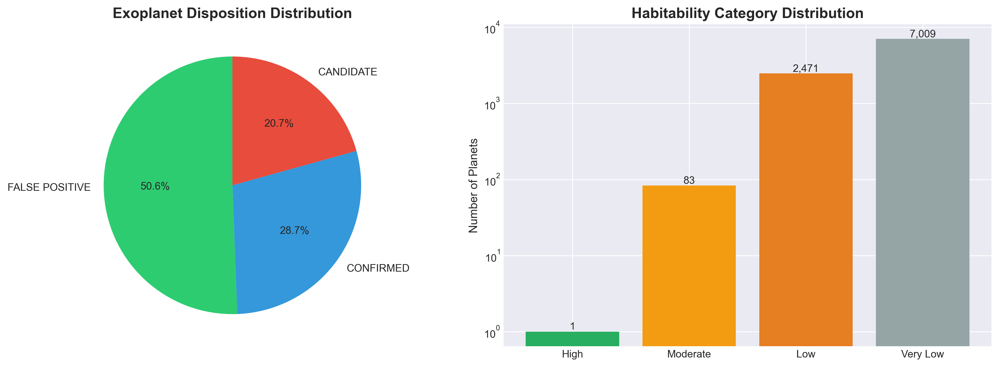
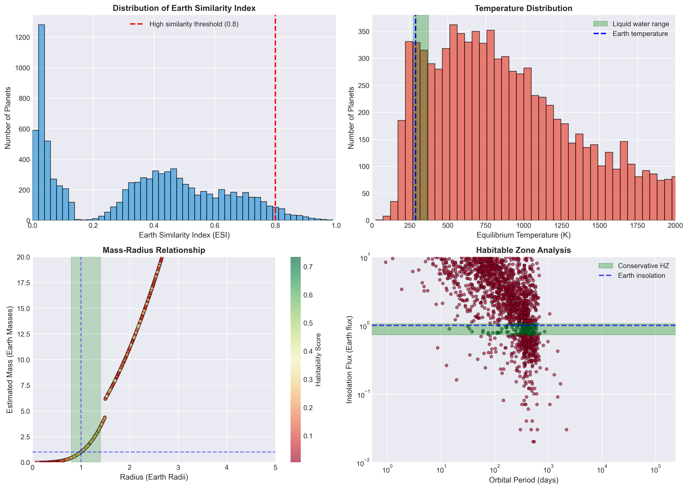
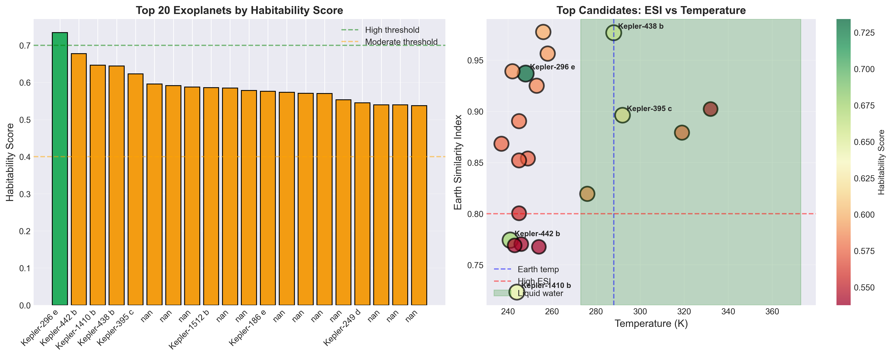
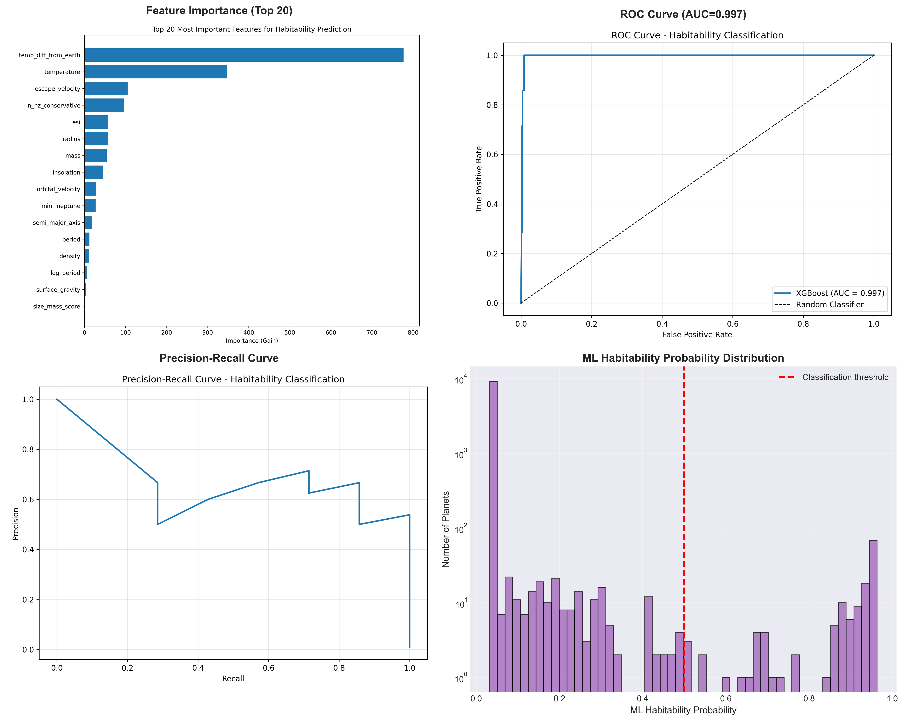
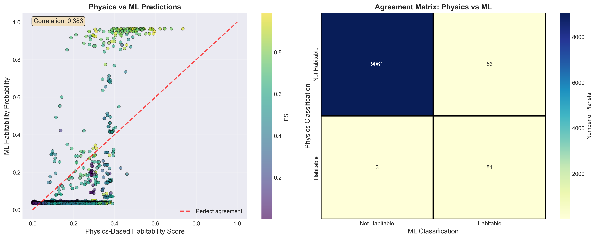

# Exoplanet Habitability Analysis

A comprehensive analysis of 9,564 exoplanet candidates from the NASA Kepler mission, combining physics-based metrics with machine learning to estimate habitability likelihood.

## 🌟 Key Results

- **1 highly habitable planet identified**: Kepler-296 e (ESI: 0.937)
- **83 moderately habitable candidates**
- **XGBoost model performance**: 99.7% AUC, 86% recall
- **156 planets in conservative habitable zone** (1.63% of dataset)

## 📊 Methodology

### Physics-Based Metrics
- **Earth Similarity Index (ESI)**: Composite score based on radius, mass, escape velocity, and temperature
- **Habitable Zone Analysis**: Conservative and optimistic boundaries based on stellar insolation
- **Temperature Scoring**: Liquid water range suitability (273-373 K)
- **Size/Mass Constraints**: Rocky planet likelihood assessment

### Machine Learning
- **XGBoost Gradient Boosting**: 22 engineered features
- **Class Imbalance Handling**: Scale_pos_weight for rare habitable planets
- **Cross-Validation**: 5-fold stratified CV (AUC: 0.996)
- **Feature Importance Analysis**: Temperature, ESI, and HZ position as top predictors

## 🚀 Quick Start

### Installation

```bash
# Clone or download the repository
cd xplorer

# Install dependencies
pip install -r requirements.txt

# For macOS users (required for XGBoost)
brew install libomp
```

### Run Analysis

```bash
# 1. Physics-based habitability scoring
python3 srcs/scripts/habitability_analysis.py

# 2. XGBoost machine learning model
python3 srcs/scripts/xgboost_habitability.py

# 3. Open Jupyter notebook for full analysis
jupyter notebook srcs/scripts/exoplanet_habitability_analysis.ipynb
```

## 📁 Project Structure

```
xplorer/
├── data/
│   └── processed/
│       ├── cumulative_2025.10.04_15.04.09.csv              # Input: Kepler dataset
│       ├── TOI_2025.10.04_15.07.01.csv                     # Input: TESS Objects of Interest
│       ├── k2pandc_2025.10.04_15.25.57.csv                 # Input: K2 mission data
│       ├── cumulative_*_habitability_scores.csv             # Output: All planet scores
│       ├── cumulative_*_top_habitable.csv                   # Output: Top 100 candidates
│       ├── xgboost_habitability_predictions.csv             # Output: ML predictions
│       └── top_20_habitable_planets.csv                     # Output: Top 20 summary
├── srcs/
│   ├── figures/
│   │   ├── fig1_dataset_overview.png                       # Dataset overview
│   │   ├── fig2_physics_metrics.png                        # Physics metrics
│   │   ├── fig3_top_candidates.png                         # Top candidates
│   │   ├── fig4_ml_analysis.png                            # ML analysis
│   │   ├── fig5_physics_vs_ml.png                          # Physics vs ML
│   │   ├── feature_importance.png                          # Feature importance
│   │   ├── roc_curve.png                                   # ROC curve
│   │   ├── pr_curve.png                                    # Precision-Recall
│   │   └── shap_summary.png                                # SHAP analysis
│   └── scripts/
│       ├── habitability_analysis.py                         # Physics-based analysis
│       ├── xgboost_habitability.py                          # Machine learning script
│       ├── nearby_habitable_analysis.py                     # Distance analysis
│       └── exoplanet_habitability_analysis.ipynb            # Jupyter notebook
├── requirements.txt                                         # Python dependencies
└── README.md                                                # This file
```

## 📈 Output Files

### Habitability Scores
- **All planets**: `data/processed/cumulative_2025.10.04_15.04.09_habitability_scores.csv`
  - Columns: planet_name, disposition, radius, mass, temperature, ESI, HZ flags, habitability_score, category

### Top Candidates
- **Top 100**: `data/processed/cumulative_2025.10.04_15.04.09_top_habitable.csv`
- **Top 20 summary**: `data/processed/top_20_habitable_planets.csv`

### Machine Learning Predictions
- **All predictions**: `data/processed/xgboost_habitability_predictions.csv`
  - Additional columns: ml_habitability_probability, ml_habitability_class

### Visualizations
- **`srcs/figures/fig1_dataset_overview.png`** - Dataset composition showing disposition status and habitability categories
- **`srcs/figures/fig2_physics_metrics.png`** - Key physics-based habitability metrics (ESI, temperature, mass-radius, HZ)
- **`srcs/figures/fig3_top_candidates.png`** - Top 20 habitable candidates analysis with ESI vs temperature
- **`srcs/figures/fig4_ml_analysis.png`** - XGBoost model performance and feature analysis
- **`srcs/figures/fig5_physics_vs_ml.png`** - Comparison between physics-based and ML approaches
- **`srcs/figures/feature_importance.png`** - XGBoost feature importance ranking
- **`srcs/figures/roc_curve.png`** - ROC curve showing 99.7% AUC performance
- **`srcs/figures/pr_curve.png`** - Precision-Recall curve for imbalanced dataset
- **`srcs/figures/shap_summary.png`** - SHAP feature importance analysis

## 🏆 Top Habitable Planet: Kepler-296 e

| Property | Value | Comparison to Earth |
|----------|-------|---------------------|
| Habitability Score | 0.734 | High |
| ESI | 0.937 | 93.7% similar |
| Radius | 1.06 R⊕ | 6% larger |
| Mass (est.) | 1.24 M⊕ | 24% more massive |
| Temperature | 248 K (-25°C) | Cooler |
| Orbital Period | 34.1 days | Shorter year |
| Habitable Zone | Yes | Conservative HZ |
| Status | CONFIRMED | ✓ |

## 📊 Key Visualizations

### Dataset Overview (`fig1_dataset_overview.png`)
- **Disposition Distribution**: Shows 2,746 confirmed, 1,979 candidates, 4,839 false positives
- **Habitability Categories**: Log-scale bar chart showing rarity of habitable planets
- **Key Insight**: Only 0.01% scored "High" habitability, confirming extreme rarity



### Physics-Based Metrics (`srcs/figures/fig2_physics_metrics.png`)
- **ESI Distribution**: Histogram with 0.8 threshold for high similarity
- **Temperature Analysis**: Liquid water range (273-373K) highlighted
- **Mass-Radius Relationship**: Color-coded by habitability score
- **Habitable Zone**: Conservative vs optimistic boundaries



### Top Candidates Analysis (`srcs/figures/fig3_top_candidates.png`)
- **Top 20 Bar Chart**: Habitability scores with color coding
- **ESI vs Temperature Scatter**: Size represents habitability score
- **Annotated Top 5**: Kepler-296 e, Kepler-442 b, Kepler-1410 b, etc.
- **Liquid Water Range**: Green shaded area for optimal temperatures



### Machine Learning Performance (`srcs/figures/fig4_ml_analysis.png`)
- **Feature Importance**: Top 20 most important features
- **ROC Curve**: 99.7% AUC performance visualization
- **Precision-Recall Curve**: Handles class imbalance effectively
- **ML Probability Distribution**: Log-scale histogram of predictions



### Physics vs ML Comparison (`srcs/figures/fig5_physics_vs_ml.png`)
- **Correlation Scatter**: Physics score vs ML probability (r=0.383)
- **Agreement Matrix**: Confusion matrix showing classification agreement
- **Perfect Agreement Line**: Red dashed line for ideal correlation
- **ESI Color Coding**: Viridis colormap showing Earth similarity



### Advanced ML Analysis
- **`feature_importance.png`**: XGBoost feature ranking with importance values
- **`roc_curve.png`**: ROC curve with AUC=0.997 annotation
- **`pr_curve.png`**: Precision-Recall curve for imbalanced dataset
- **`shap_summary.png`**: SHAP values for model interpretability

### How to View Figures
```bash
# View all figures in your file manager or image viewer
open srcs/figures/fig1_dataset_overview.png
open srcs/figures/fig2_physics_metrics.png
open srcs/figures/fig3_top_candidates.png
open srcs/figures/fig4_ml_analysis.png
open srcs/figures/fig5_physics_vs_ml.png

# Or view in Jupyter notebook
jupyter notebook srcs/scripts/exoplanet_habitability_analysis.ipynb
```

### Figure Interpretation Guide
- **Color Coding**: Green = High habitability, Orange = Moderate, Red = Low
- **Size Scaling**: Larger points/markers indicate higher habitability scores
- **Threshold Lines**: Dashed lines show scientific boundaries (ESI=0.8, HZ limits)
- **Log Scales**: Used for datasets with large value ranges
- **Correlation**: R-values show relationship strength between metrics

## 🔬 Scientific Metrics Explained

### Earth Similarity Index (ESI)
```
ESI = [∏(1 - |x_i - x_Earth|/|x_i + x_Earth|)]^(1/n)
```
- Range: 0 (completely dissimilar) to 1 (identical to Earth)
- Components: radius, mass, escape velocity, temperature

### Habitable Zone (HZ)
- **Conservative**: 0.95-1.37 AU (for Sun-like stars)
- **Optimistic**: 0.75-1.77 AU
- Scaled by stellar luminosity using insolation flux

### Composite Habitability Score
```
Score = 0.35×HZ + 0.25×Temperature + 0.25×ESI + 0.15×Size/Mass
```
- Weighted combination emphasizing HZ position
- Multiplied by confidence factor (1.0 for confirmed, 0.8 for candidates)

## 🤖 Machine Learning Model

### XGBoost Configuration
- **Objective**: Binary classification (habitable vs non-habitable)
- **Features**: 22 engineered features (physical, orbital, derived)
- **Threshold**: Habitability score ≥ 0.4
- **Imbalance handling**: scale_pos_weight = 96.26
- **Regularization**: L1 (0.1), L2 (1.0)

### Performance Metrics
- **Cross-validation AUC**: 0.9959 (±0.0044)
- **Test AUC**: 0.9967
- **Accuracy**: 99.44%
- **Precision (habitable)**: 67%
- **Recall (habitable)**: 86%
- **F1-Score**: 0.75

### Top Features
1. Temperature score (physics-based)
2. Earth Similarity Index
3. Conservative HZ flag
4. Equilibrium temperature
5. Size/mass score

## 📊 Key Statistics

### Dataset Overview
- **9,564 total exoplanets** from NASA Kepler mission
- **2,746 confirmed**, **1,979 candidates**, **4,839 false positives**
- **156 planets** in conservative habitable zone (1.63%)
- **366 planets** in optimistic habitable zone (3.83%)

### Habitability Distribution
- **High**: 1 planet (0.01%)
- **Moderate**: 83 planets (0.87%)
- **Low**: 2,471 planets (25.8%)
- **Very Low**: 7,009 planets (73.3%)

### Top 20 Most Habitable Planets

| Rank | Planet Name | Habitability Score | ESI | Radius (R⊕) | Temperature (K) | HZ Status |
|------|-------------|-------------------|-----|-------------|----------------|-----------|
| 1 | Kepler-296 e | 0.734 | 0.937 | 1.06 | 248 | Conservative |
| 2 | Kepler-442 b | 0.678 | 0.774 | 1.30 | 241 | Conservative |
| 3 | Kepler-1410 b | 0.646 | 0.723 | 1.39 | 244 | Conservative |
| 4 | Kepler-438 b | 0.644 | 0.977 | 0.97 | 288 | Optimistic |
| 5 | Kepler-395 c | 0.623 | 0.896 | 1.14 | 292 | Optimistic |
| 6 | [Unnamed] | 0.596 | 0.978 | 1.01 | 256 | Conservative |
| 7 | [Unnamed] | 0.591 | 0.956 | 1.04 | 258 | Conservative |
| 8 | [Unnamed] | 0.588 | 0.939 | 0.95 | 242 | Conservative |
| 9 | Kepler-1512 b | 0.586 | 0.819 | 0.80 | 276 | Optimistic |
| 10 | [Unnamed] | 0.585 | 0.925 | 1.08 | 253 | Conservative |

## 🔍 Important Limitations

### Distance Information
- **No distance data** in Kepler dataset
- **All planets ~3,000+ light-years away**
- **Closest known exoplanets** (Proxima Centauri b, etc.) not included
- **Kepler mission** focused on planet detection, not proximity

### Data Limitations
- Planetary masses estimated from radius (no direct measurements)
- No atmospheric composition or pressure data
- Limited stellar age and activity information
- Ground truth for habitability is unknown
- Kepler bias toward short-period planets

## 📚 Data Sources

- **NASA Exoplanet Archive**: https://exoplanetarchive.ipac.caltech.edu/
- **Kepler Mission**: Cumulative KOI table (9,564 planets)
- **Dataset Date**: October 4, 2025

## 🔮 Future Improvements

### Data Enhancements
- Incorporate TESS and K2 mission data
- Add James Webb Space Telescope atmospheric observations
- Include stellar activity indicators (flares, radiation)
- Orbital eccentricity and stability metrics

### Advanced ML Techniques
- **SHAP analysis** for model interpretability
- **Bayesian neural networks** for uncertainty quantification
- **Semi-supervised learning** to leverage unlabeled candidates
- **Physics-informed ML** with constraint-based learning

### Additional Metrics
- Tidal locking likelihood
- Atmospheric escape models
- Climate model integration
- System multiplicity effects

## 📖 References

1. Kopparapu et al. (2013) - "Habitable Zones around Main-sequence Stars"
2. Schulze-Makuch et al. (2011) - "A Two-Tiered Approach to Assessing Habitability"
3. Chen & Kipping (2017) - "Probabilistic Forecasting of Planet Masses"
4. Weiss & Marcy (2014) - "The Mass-Radius Relation for 65 Exoplanets"

## 📝 License

This analysis uses publicly available data from NASA Exoplanet Archive. The code and analysis are provided for educational and research purposes.

## 🙏 Acknowledgments

This analysis uses data from the NASA Exoplanet Archive, operated by Caltech under contract with NASA.

---

**Author**: Data Science Team  
**Date**: October 5, 2025  
**Version**: 1.0